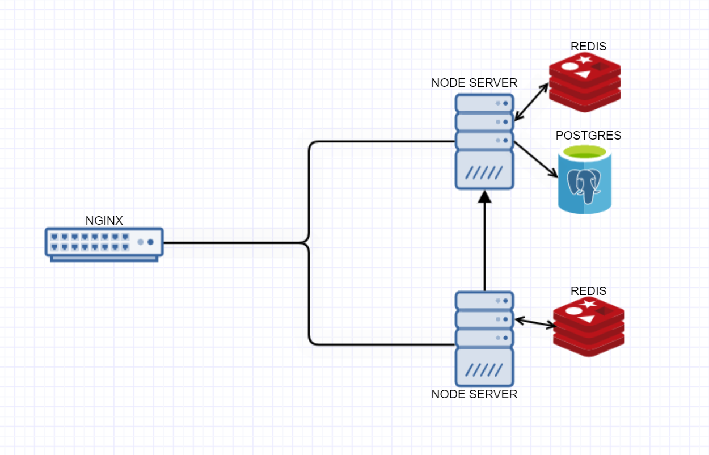
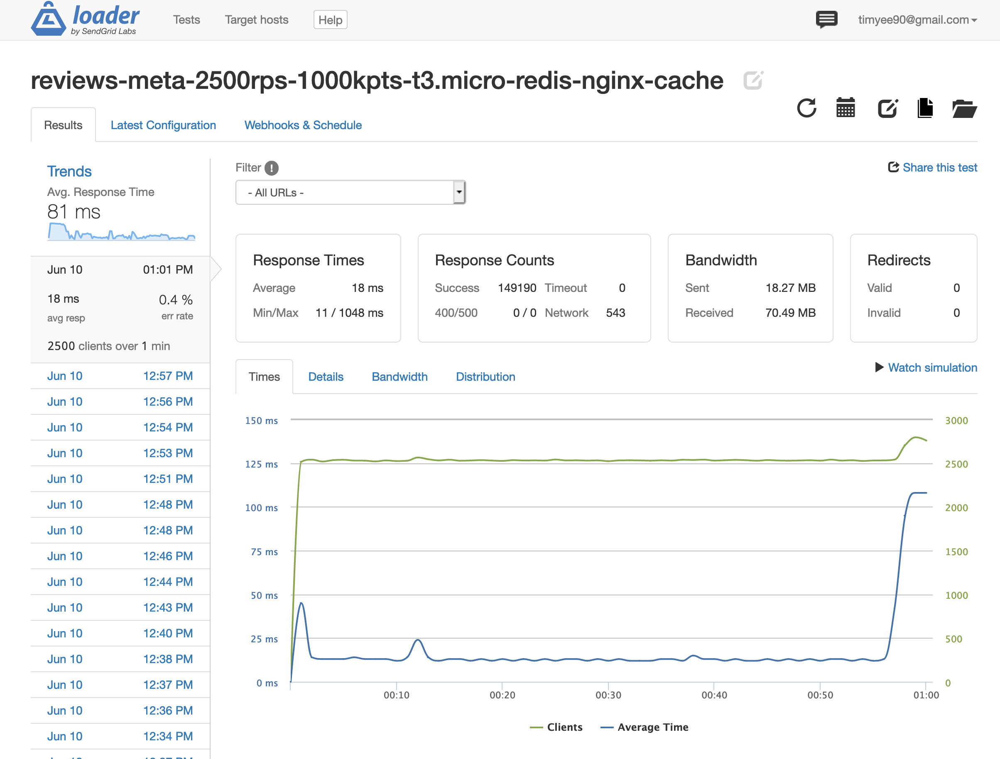

# Sostratus

### Introduction
scaling ez-commerce reviews API

## Reviews Service API
Technologies:
1. Node.js
2. PostgreSQL
3. Redis
4. Nginx
5. Docker

## Backend Architecture

## Stress testing with Loader.io

